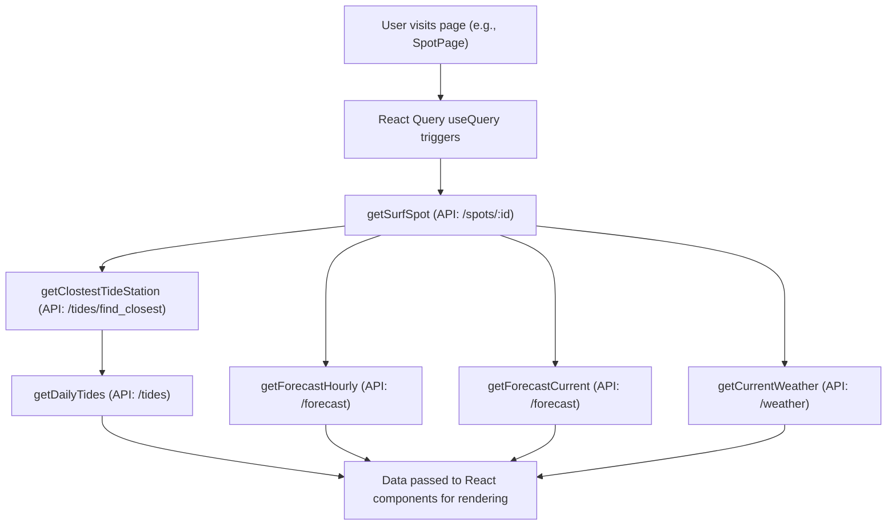
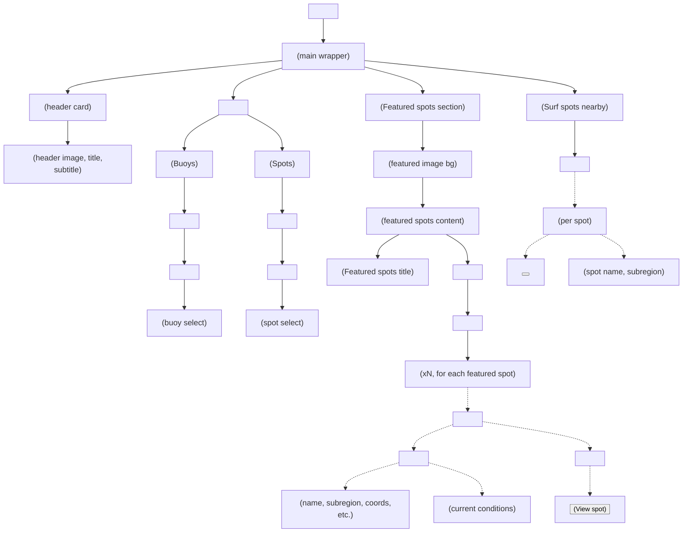

# Surfe Diem App: Data Flow & Component Hierarchy

This document contains two Mermaid diagrams for the Surfe Diem app:
- **Data Flow** (high-level API and data movement)
- **Home Page Component Hierarchy** (detailed React component tree)

You can preview or export these diagrams using the [Mermaid Live Editor](https://mermaid.live/) or a compatible Markdown/Mermaid tool. Set the theme to **light** ("default") for best results in docs.

---

## 1. Data Flow Diagram

---

## 2. Home Page Component Hierarchy

---

**Instructions:**
- Copy the code blocks above into the [Mermaid Live Editor](https://mermaid.live/) or your favorite Mermaid-compatible tool.
- Set the theme to **default** (light) for best results.
- Export as PNG or SVG as needed for your documentation. 